# DcmAppTest

## 基本功能
DcmAppTest相当于VehicleSpy3和Canoe一个子集，只包含车载诊断测试功能。当前支持的TP协议只有ISO15765协议，应用协议支持ISO14229协议

## 功能列表

当前版本的DcmAppTest支持一下功能：

+ 支持使用广成科技的USB CAN作为CAN输入/输出设备
+ 支持ISO15765传输协议
+ 支持ISO14229应用协议
+ 支持以配置的方式来设置每个应用功能请求的数据，软件会自动解析配置来生成响应的操作UI,用户可以通过操作UI来改变要传输的数据，当前版本支持以下数据格式：

  1. Xncode格式，此种格式下的值表示多个状态，每个值对应一个单独的状态, 在UI展示上是以组合框的形式展示出来，用户通过选择组合框，可以设置所选择状态对应的值
  2. Phy格式，此种格式下的数据表示一个物理量
  3. Bcd格式，此种格式下，表示8421BCD值；这种格式又有两种子格式，一种表示纯粹的8421BCD值（可以取A-F)，一种是只能取数字值(0-9)，对于前者可以定义一个分隔符来进行分隔
（主要适用于展示版本信息），后者可以定义类似于Phy的格式，来表示物理量
  4. ASCII格式，此种格式下的数据表示多个ASCII字符

+ 支持以配置的方式来定义接收数据的格式，软件会自动根据配置来解析接收到的数据
+ 支持多种形式展示数据（诊断应用数据，应用层数据）
+ 支持保存/加载诊断应用数据
+ 支持解析通用的ISO14229应用数据，并且以高亮的形式突出显示肯定响应和否定响应
+ 支持XP系统（但是需要XP系统安装.net 4, 当前XP系统最后支持的.net版本是4.0.3）
+ 支持Dock布局
+ 支持自动保存用户自定以的Dock布局，用户可以根据自己的喜好来调整Dock布局
+ 支持主题设置，当前支持VS2015-Blue, VS2015-Dark, VS2015-Light三个主题（这儿需要非常感谢DockSuite这个开源项目）
+ 安全算法以插件的形式进行管理，这样方便扩展

## 优势

+ 以配置的方式来动态生成要设置的UI, 可以极大加快开发效率，不用每次需求变更的时候都需要重新编写软件
+ 以配置的方式来定义接收数据的格式，并且软件在接收到应用数据的时候会自动解析
+ 集成配置编辑器，这样可以使用编辑器来修改配置，不用手动修改配置文件，可以避免出错
+ 相比较于Canoe或者Spy3，加上对应的配套软件，至少需要上万元成本，而使用本软件，只需要花几百元买个广成科技的UsbCan, 加上本软件就可以完成软件测试的基本需求，何乐而不为呢
+ 内部使用C# .net4 winform作为开发平台，当前即使XP系统也可以安装.net4
+ 支持Dock，并且运用用户调整布局，支持自动保存
+ 支持主题设置功能
+ 安全算法以插件的形式进行管理，这样方便扩展

## 软件快照

## win10 系统下使用快照

### VS2015 Blue主题

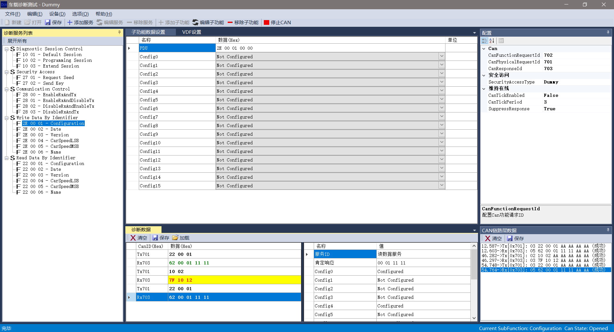

### VS2015 Dark主题

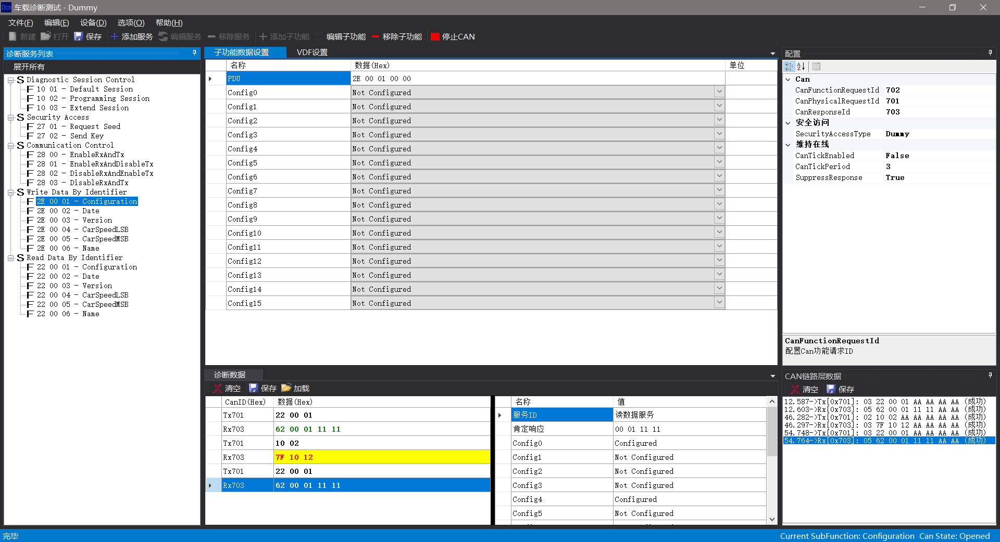

### VS2015 Light主题

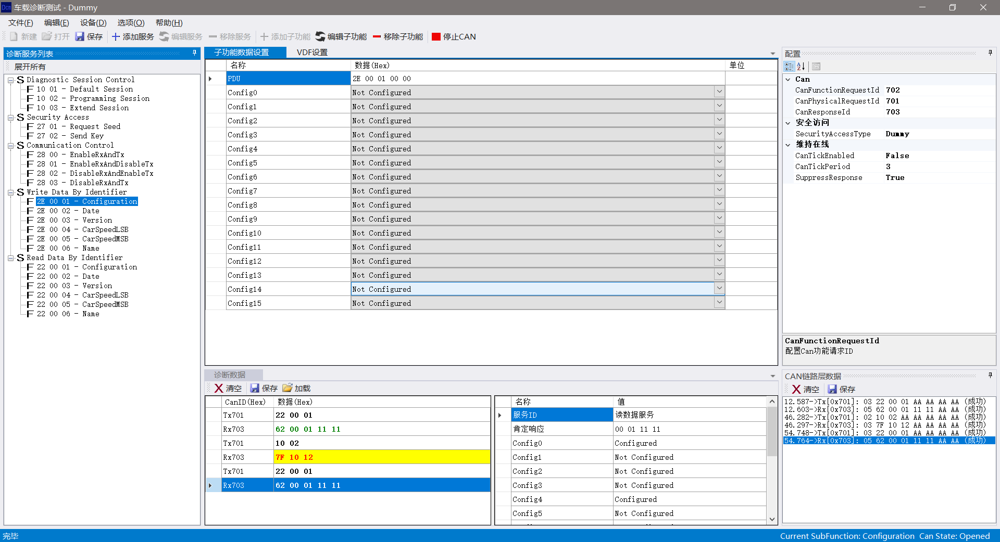

## XP 系统下使用快照

### VS2015 Blue主题

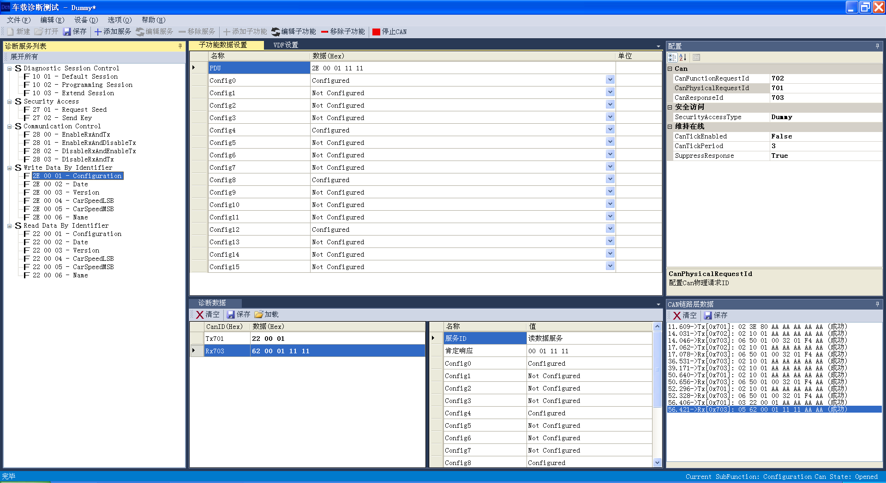

### VS2015 Dark主题


### VS2015 Light主题

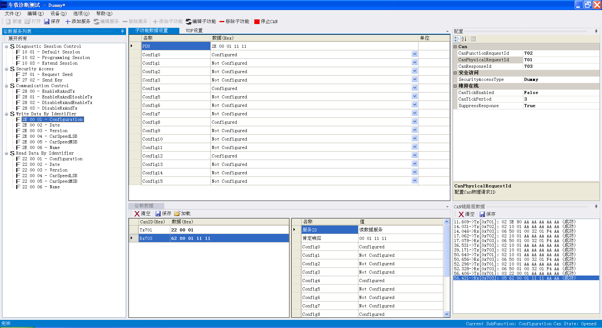

## 安装

安装步骤：

1. 首先您需要拥有一个广成科技的USBCAN盒，然后安装好相应的驱动程序
2. 请确保您的PC上已经晚装了.net 4以上的版本，如果没有请进行安装
3. 在后面的历史版本中，下载一个最新的版本, 您会得到一个zip文件，将之解压到指定的目录中
4. 在前两个文件都满足后，那么打开目录中的exe文件即可运行程序


历史版本:

+ [V1.0.0](https://raw.githubusercontent.com/twoflyliu/DcmAppTest/master/Dist/DcmAppTest-V1.0.0.zip "V1.0.0版本")

## 使用指导

下面的例子，将会介绍DcmAppTest的常用操作，主要设计一下几个内容(实际上就是描述Demos Dummy工程的创建)：

1. 如何定义自己的插件类型
2. 如何安装自己的插件类型
3. 主应用窗口的基本介绍
4. 基本使用

### 如何定义自己的插件

1. 使用VS2017社区版(我使用的版本，您至少需求>=此版本, 这样工程才可以进行编译)Visual C#创建类库工程, 入下图所示：

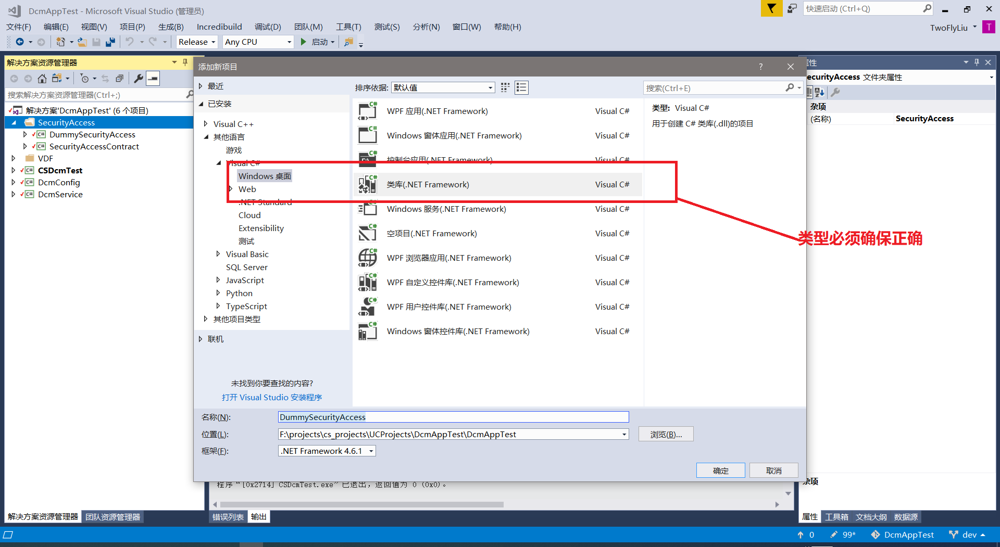

2. 设置项目引用的类型

+ 需要引用SecurityAccessContract, 因为SecurityAccessContract项目中定义了插件接口的类型，入下图所示：

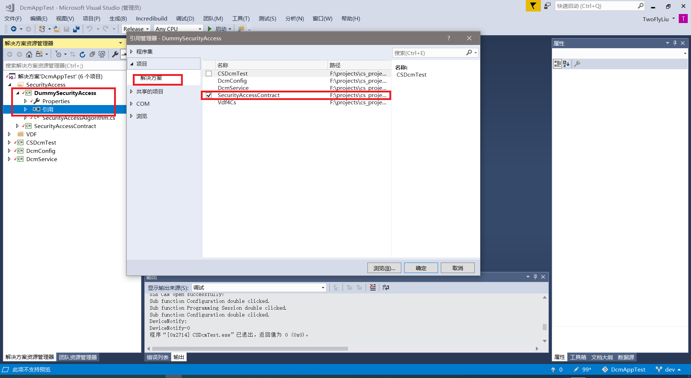

+ 需要引用System.ComponentModel.Composition程序集，因为此程序集定义了插件导出的方式，入下图所示：

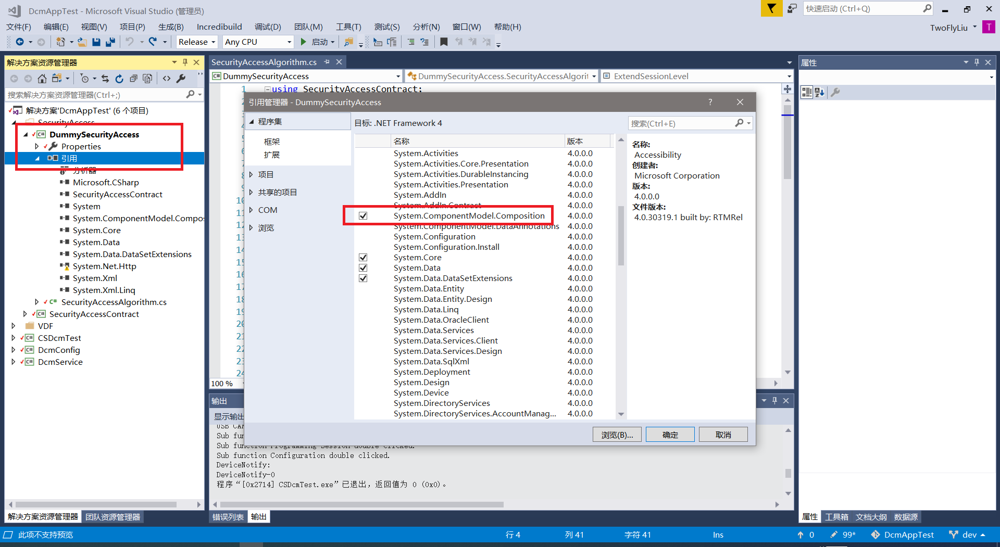

3. 实现插件

在实现插件之前，需要介绍一下SecurityAccessContract.ISecurityAccessAlgorithm接口

此接口定义如下：

```cs
namespace SecurityAccessContract
{
    public interface ISecurityAccessAlgorithm
    {
        /// <summary>
        /// 算法实现
        /// </summary>
        /// <param name="securityLevel">算法安全级别</param>
        /// <param name="rawData">原始数据</param>
        /// <returns>加密后的数据</returns>
        List<byte> Encrypt(int securityLevel, List<byte> rawData);

        /// <summary>
        /// 算法名称
        /// </summary>
        string Name { get;  }
    
    }
}
```

此接收就是插件需要实现，并且导出的接口， 其中：

+ Encrypt方法用于根据种子数据来生成对应的Key, 根据ISO14229定义， securityLevel是27 SID后面的数据，一般为奇数；rawData 为27 奇数请求返回的种子数据，
此方法返回值为Key数据
+ Name 表示安全算法的名称，因为最终所有的插件需要被放置在一个组合框中供用户来选择插件类型，所以插件需要一个可以被显示的字符串，而这个方法就是返回这个字符串

下面来看一下Dummy安全算法的实现，具体的实现, 代码如下所示：

```cs
namespace DummySecurityAccess
{
    [Export(typeof(ISecurityAccessAlgorithm))]
    public class SecurityAccessAlgorithm : ISecurityAccessAlgorithm
    {
        public const int ExtendSessionLevel = 0x01;

        public string Name => "Dummy";

        public List<byte> Encrypt(int securityLevel, List<byte> rawData)
        {
            if (securityLevel % 2 == 0)
            {
                securityLevel -= 1;
            
            }

            if (securityLevel < 0)
            {
                throw new ArgumentException("security level must be great than 0");
            
            }

            if (ExtendSessionLevel == securityLevel)
            {
                return ExtendSessionLevelEncrypt(rawData);
            
            }
            else
            {
                throw new ArgumentException("Unsupported security level " + securityLevel.ToString());
            
            }
        
        }

        private List<byte> ExtendSessionLevelEncrypt(List<byte> seed)
        {
            if (seed.Count != 4)
            {
                throw new ArgumentException("seed data length must be 4");
            
            }

            List<byte> key = new List<byte>();
            const byte increVal = 0x55;

            foreach (var s in seed)
            {
                key.Add((byte)(increVal + s));
            
            }

            return key;
        
        }
    
    }

}
```

首先，定义SecurityAccessAlgorithm类，并且让此类实现ISecurityAccessAlgorithm, 除此之外，此类还有一个Attribute:`[Export(typeof(ISecurityAccessAlgorithm))]`, 只有定义
了这个Attribute，那么这个插件才可以被当作插件识别到

正如何您所看到，插件的名称为Dummy(`public string Name => "Dummy"`), 插件安全算法的实现，是只支持安全级别为1的级别；并且要求种子的长度为4；当前两者都满足的时候，
会将总之的每个值都加上0x55作为Key返回


4. 编译生成， 终止应该生成一个名为DummySecurityAccess.dll文件, 入下图所示：


### 如何安装自己的插件类型

1. 解压缩历史版本中列出的压缩文件到指定目录中
2. 如果解压缩目录中没有addins文件，则新建此文件夹
3. 将上面最后编译生成的插件DummySecurityAccess.dll拷贝到此文件夹中即可

### 主应用窗口的基本介绍

主窗口的功能分类入下图所示：

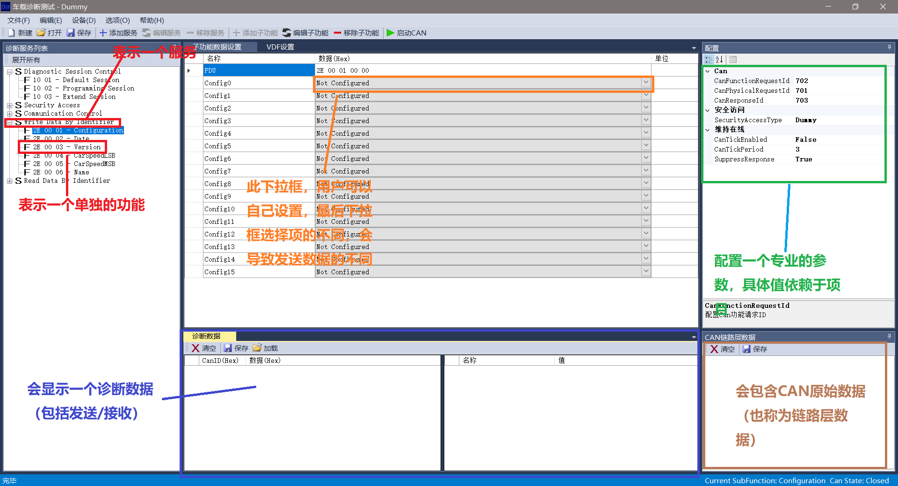

Vdf窗口分类入下图所示：

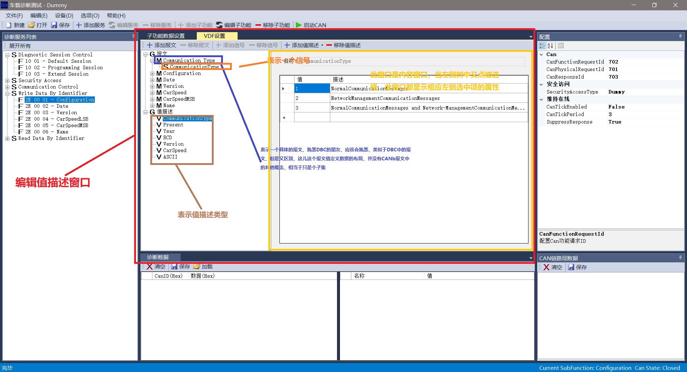

简单介绍一些里面设计的改变

1. 服务 - 对应于ISO14229中的服务，他们一般是一一对应关系，当然你也可以定义一些ISO14229之外的服务，本软件也是支持的
2. 子功能 - 对应于ISO14229中的子功能，但是不是绝对的对应，这儿更准确的将，可以成为功能，每个子功能对应的功能（因为ISO14229中定义某些服务是没有子功能的）
3. 配置窗口中设计到一下改变：

+ 物理请求CANID， 熟悉CAN的朋友肯定熟悉此改变
+ 功能请求CANiD
+ 相应CANID
+ 安全算法类型，这儿以组合框的形式展现，当您下载的时候，会出现Dummy，Dummy就是之前我们安装的插件
+ 维持在线的相关设置，也是ISO协议定义的一个服务

4. 值描述文件中，设计到一下改变：

+ 报文 - 定义了一个被引用的名称，描述和字节长度
+ 信号 - 定义了一个被引用的名称，起始位，长度，字节序和值描述
+ 值描述 - 定义了值对应的描述 （四种类型值） 

### 基本使用

#### 新建一个文件, 可以点击菜单，或者工具按钮，入下图所示（仅展示工具按钮）：

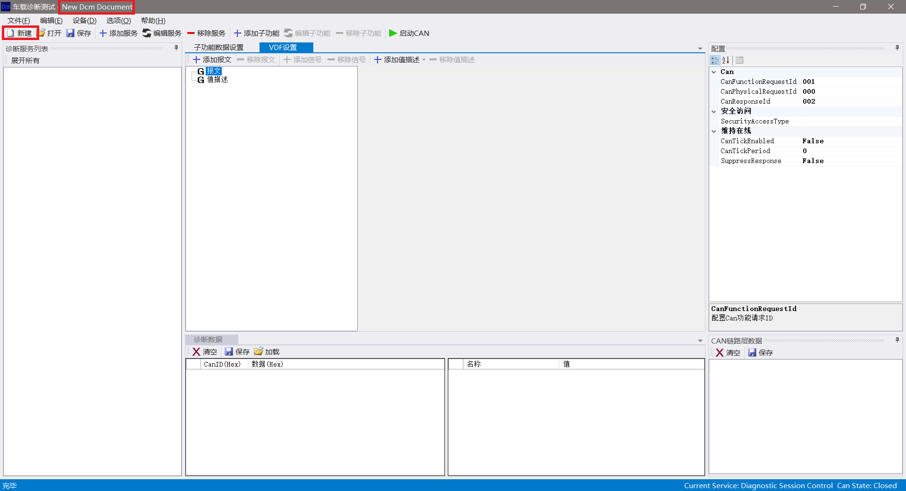

#### 保存文件到指定路径, 入下图所示：

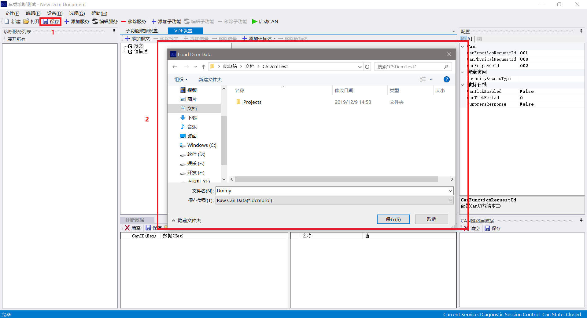

#### 创建Communication Control服务, 入下图所示：

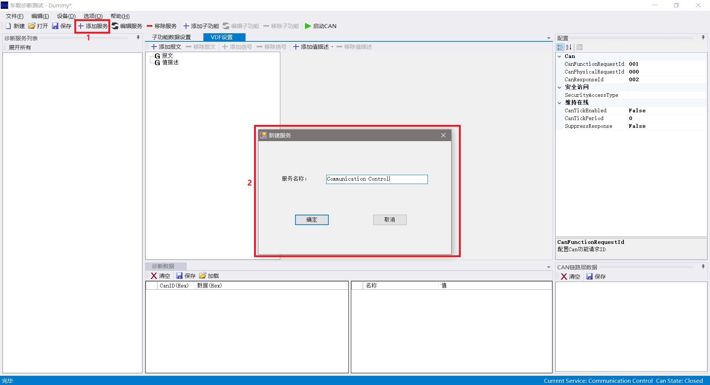


####  创建Communication Type 值描述，入下图所示：


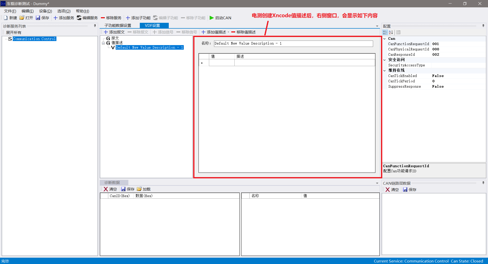

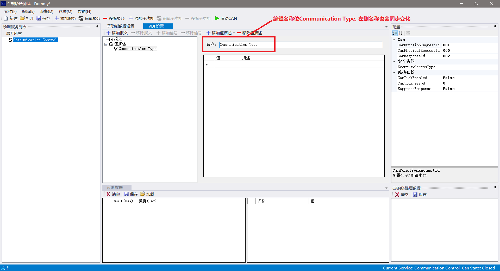

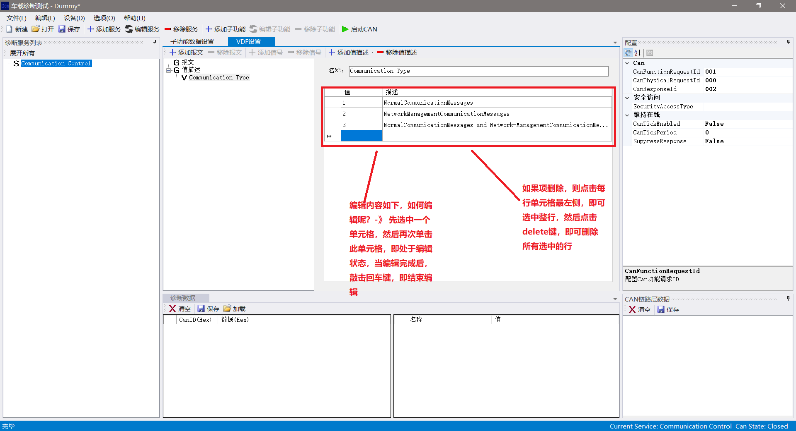

#### 创建Communication Type报文, 入下图所示

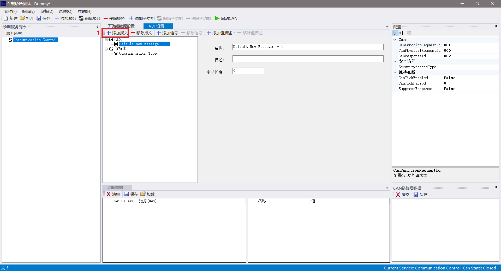

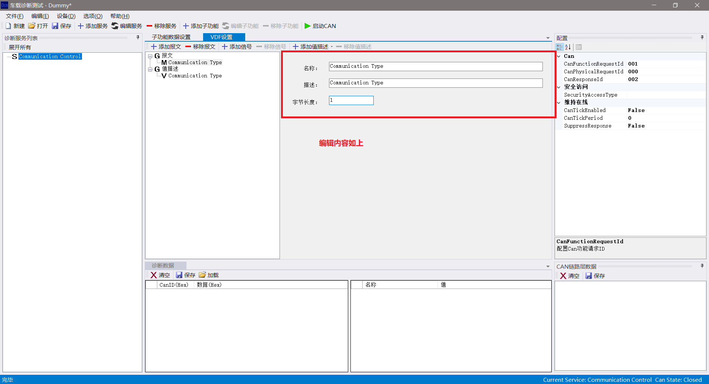

#### 创建Communition Type信号， 入下图所示

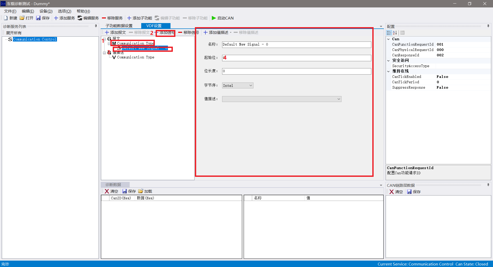


#### 创建EnableRxAndTx子功能，入下图所示

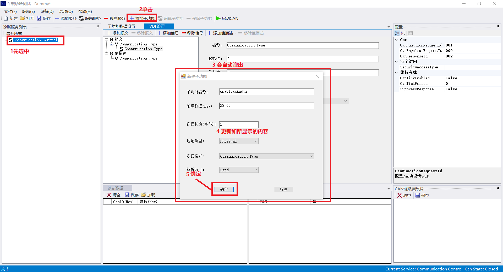

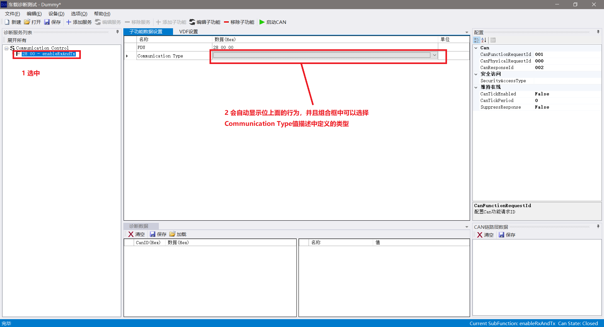


### 其他

熟悉上面的用户，即基本入门了，对于其他功能，可以参考Demos/Dummy.dcmproj文件

对于其他的功能值简单说一下：
1. 对于需要接收某些接收到的数据，只需要将子功能的解析方法设置位Receive即可
2. 对于其他的只描述，比如Bcd, Phy, ASCII，只需要在在添加只描述菜单中选择相应的值描述即可


## 项目结构介绍

### 工程文件目录

+ DcmConfig 项目 - 是一个c# .net lib项目，主要负责配置的序列化和反序列化操作
+ DcmService 项目 - 是一个C# .net lib项目，主要负责实现ISO14229和ISO15765
+ Vdf4Cs 项目 - 是一个c# .net lib项目，此项目定义了值描述文件（Value Description File）, 相关配置，他是
DcmConfig项目的一个子配置，这儿为什么把他单独领出来呢？主要是为了便于复用，因为值描述这种编码/解析需求，
不单单仅仅是本项目会使用到，在其他项目中，比如串口数据的编码/解码也可以使用
+ SecurityAccessContract 项目 - 是一个c# .net lib主要负责定义插件接口
+ DummySecurityAccess 项目 - 是一个c# .net lib项目，他是SecurityAccessContract的一个虚拟实现，至少编写号的插件如何安装，请看使用教程
+ CSDcmTest 项目 - 是一个C# .net winform项目， 他是主项目，主要负责整合其他库来实现所有功能

### 其他文件目录

+ Demos 目录 - 存在创建好的Dummy项目所需文件，在熟悉此软件功能的时候，可以使用此软件来进行测试
+ Deps 目录 - 存在本项目中需要用到的两个库文件，一个是DockSuite库文件，一个是主题文件。这儿为什么把他单独
领出来，而没有使用NuGet来进行管理呢，是因为NuGet获取的库在，面板Closeable为False的时候，不会隐藏关闭安装，
而这儿单独给出的两个文件会隐藏关闭按钮
+ Dist 目录 - 存放每次软件释放时候的版本，以Zip格式进行压缩。用户如果项使用每个版本的软件，只需要下载指定的
定版本的zip，然后解压然后执行exe文件即可（前者，在PC上需要安装.net 4以上的版本）
+ Docs 目录 - 存放一些README文件中引用的图片

## 致谢

+ 感谢DockSuite项目

## 参考

+ [ecanspy3](https://github.com/TwoFlyLiu/ecanspy3 "另外一个ECAN的组态软件，主要负责模拟整车的应用报文数据")
